# EmotionBot — Emotionally-Driven Chatbot

EmotionBot is an emotionally-aware conversational AI that maintains a dynamic emotional state and lets that state influence every response. Built as a modular, self-contained system, it demonstrates how a small set of components can work together to create natural, emotionally intelligent conversations.

## ✨ Features

- **Real-time Emotion Tracking**: Tracks continuous valence (-1 to 1) and arousal (0 to 1) values
- **9 Discrete Emotions**: neutral, joy, sadness, anger, fear, surprise, disgust, curiosity, affection  
- **🎭 Personality System**: 7 distinct personality types that influence emotional responses and conversation style
- **Intelligent Appraisal**: Uses transformer models (sentiment analysis + GoEmotions) with graceful fallbacks
- **Adaptive Response Generation**: OpenAI GPT integration with local fallback system
- **Dynamic Style Adaptation**: Adjusts verbosity, directness, warmth, punctuation, and emoji usage
- **Live Visualization**: Real-time matplotlib plotting of emotional state evolution
- **Conversation Memory**: Maintains context and tracks discussion topics
- **Robust Configuration**: Easily tunable emotional dynamics and behavior parameters

---

## 🧠 How It Works

1. **Input Appraisal**: Transformer models (DistilBERT + GoEmotions) analyze user text for sentiment and discrete emotions, with neutral fallbacks when models are unavailable.

2. **Core Affect Update**: The system maintains continuous valence (negative↔positive) and arousal (calm↔excited) values. New inputs create deltas that are:
   - Scaled by input intensity for stronger impact from emphatic messages  
   - Dampened by configurable inertia to prevent emotional whiplash
   - Subject to exponential decay back toward baseline over time

3. **Discrete Emotion Selection**: Maps current (valence, arousal) coordinates to the nearest emotion in EMOTION_MAP using Euclidean distance, with minimum duration requirements to prevent flickering and force-switch capability for high-intensity inputs.

4. **Response Generation**: A "brain" module creates base responses using either:
   - **OpenAI GPT**: Emotion-aware system prompts with GPT-4o-mini (when `OPENAI_API_KEY` available)
   - **Local Heuristics**: Deterministic templates with emotion-specific response patterns

5. **Behavioral Styling**: The behavior module post-processes responses by adjusting:
   - Length based on verbosity and arousal levels
   - Directness (hedging vs. assertiveness) 
   - Warmth markers and emoji probability
   - Punctuation patterns and hesitation markers

The conversation history is stored in `ConversationMemory` which provides context windows to the brain module and tracks discussion topics over time.

---

## 🏗️ Architecture

EmotionBot implements a sophisticated 5-stage emotional processing pipeline with modular components working in concert. Here's the complete system architecture:

### 🔄 Core Processing Pipeline

The main emotional update loop (`main.py:emotional_update()`) follows a sophisticated 5-stage pipeline:

```mermaid
graph TD
    A[👤 User Input] --> B[⏰ Stage 1: Decay]
    B --> C[🧠 Stage 2: Appraisal]
    C --> D[💫 Stage 3: Core Affect Update]
    D --> E[🎯 Stage 4: Discrete Mapping]
    E --> F[💬 Stage 5: Response Generation]
    F --> G[🎨 Stage 6: Behavioral Styling]
    G --> H[✨ Styled Response]

    subgraph "Stage 1: Decay"
        B1[EmotionState.decay_toward_baseline]
        B2[valence_half_life: 900s]
        B3[arousal_half_life: 600s]
        B4[Exponential decay toward baselines]
        B1 --> B2
        B1 --> B3
        B1 --> B4
    end

    subgraph "Stage 2: Appraisal"
        C1[nlp.appraise]
        C2[DistilBERT Sentiment Analysis]
        C3[GoEmotions Classification]
        C4[Appraisal: sentiment, intensity, discrete_hint]
        C5[Graceful fallback if transformers unavailable]
        C1 --> C2
        C1 --> C3
        C2 --> C4
        C3 --> C4
        C1 --> C5
    end

    subgraph "Stage 3: Core Affect Update"
        D1[Calculate Base Deltas]
        D2[Apply Personality Modifiers]
        D3[Apply Randomness Modifiers]
        D4[Add Discrete Emotion Nudges]
        D5[Apply with Inertia Dampening]
        D1 --> D2
        D2 --> D3
        D3 --> D4
        D4 --> D5
    end

    subgraph "Stage 4: Discrete Mapping"
        E1[Euclidean Distance to EMOTION_MAP]
        E2[Check Stickiness Rules]
        E3[Force Switch Conditions]
        E4[Update Current Emotion]
        E1 --> E2
        E2 --> E3
        E3 --> E4
    end

    subgraph "Stage 5: Response Generation"
        F1[Memory Context Window]
        F2[Brain Module]
        F3[OpenAI GPT-4o-mini Primary]
        F4[Local Template Fallback]
        F5[Base Response]
        F1 --> F2
        F2 --> F3
        F2 --> F4
        F3 --> F5
        F4 --> F5
    end

    subgraph "Stage 6: Behavioral Styling"
        G1[Emotion Style Presets]
        G2[Personality Modifiers]
        G3[Randomness Variations]
        G4[Content Transformations]
        G5[Punctuation & Emoji Enhancement]
        G1 --> G2
        G2 --> G3
        G3 --> G4
        G4 --> G5
    end

    style A fill:#e1f5fe
    style H fill:#c8e6c9
    style B fill:#fff3e0
    style C fill:#fce4ec
    style D fill:#f3e5f5
    style E fill:#e8f5e8
    style F fill:#fff8e1
    style G fill:#e0f2f1
```



### 🏗️ System Architecture Overview

```mermaid
graph TB
    subgraph "🎮 CLI Interface"
        CLI[main.py]
        CMD[Commands: :state, :personality, :switch]
    end

    subgraph "🧠 Core Emotion Engine"
        ES[emotions.py<br/>EmotionState]
        NLP[nlp.py<br/>NLP Processing]
        PERS[personality.py<br/>7 Personality Types]
        RAND[randomness.py<br/>Human Variability]
    end

    subgraph "💬 Response Generation"
        BRAIN[brain.py<br/>OpenAI + Local Fallback]
        MEM[memory.py<br/>Conversation Context]
        BEH[behavior.py<br/>Emotional Styling]
    end

    subgraph "📊 Supporting Systems"
        CFG[config.py<br/>Centralized Settings]
        TEL[telemetry.py<br/>Real-time Visualization]
    end

    subgraph "🔄 Data Flow"
        INPUT[User Input] --> NLP
        NLP --> ES
        ES --> BRAIN
        MEM --> BRAIN
        BRAIN --> BEH
        BEH --> OUTPUT[Styled Response]
    end

    CLI --> ES
    CLI --> PERS
    CLI --> RAND
    CLI --> TEL
    ES --> TEL
    PERS --> ES
    RAND --> ES
    RAND --> BEH
    CFG --> ES
    CFG --> BRAIN
    CFG --> BEH
    CFG --> PERS
    CFG --> RAND

    style CLI fill:#e3f2fd
    style ES fill:#f3e5f5
    style NLP fill:#fce4ec
    style PERS fill:#e8f5e8
    style RAND fill:#fff3e0
    style BRAIN fill:#fff8e1
    style MEM fill:#e0f2f1
    style BEH fill:#f9fbe7
    style CFG fill:#fafafa
    style TEL fill:#e1f5fe
```



### 🎭 Emotion Processing Detail

```mermaid
graph LR
    subgraph "Russell's Circumplex Model"
        VA[Valence: -1 to 1<br/>Negative ↔ Positive]
        AR[Arousal: 0 to 1<br/>Calm ↔ Excited]
    end

    subgraph "9 Discrete Emotions"
        JOY[😄 Joy<br/>v:0.7, a:0.6]
        SAD[😔 Sadness<br/>v:-0.7, a:0.3]
        ANG[😠 Anger<br/>v:-0.6, a:0.8]
        FEAR[😨 Fear<br/>v:-0.8, a:0.7]
        SURP[😲 Surprise<br/>v:0.2, a:0.9]
        DISG[🤢 Disgust<br/>v:-0.6, a:0.5]
        CUR[🤔 Curiosity<br/>v:0.2, a:0.5]
        AFF[❤️ Affection<br/>v:0.6, a:0.4]
        NEU[😐 Neutral<br/>v:0.0, a:0.2]
    end

    subgraph "Dynamics"
        DECAY[Exponential Decay<br/>Half-life Based]
        INERT[Inertia Dampening<br/>Prevents Whiplash]
        FORCE[Force Switch<br/>High Intensity Override]
    end

    VA --> JOY
    VA --> SAD
    VA --> ANG
    AR --> JOY
    AR --> SAD
    AR --> ANG
    
    DECAY --> VA
    DECAY --> AR
    INERT --> VA
    INERT --> AR
    FORCE --> JOY
    FORCE --> ANG

    style VA fill:#e1f5fe
    style AR fill:#fff3e0
    style JOY fill:#c8e6c9
    style SAD fill:#bbdefb
    style ANG fill:#ffcdd2
    style DECAY fill:#f3e5f5
    style INERT fill:#e8f5e8
    style FORCE fill:#fff8e1
```



### 📦 Core Modules Deep Dive

#### 🎯 `main.py` - CLI Orchestration & Pipeline Control
- **`run_cli()`**: Main interaction loop with command parsing (`:state`, `:personality`, `:switch`, etc.)
- **`emotional_update()`**: The 5-stage pipeline orchestrator
- **Initialization**: Sets up personality, randomness engine, emotion state with baselines
- **Integration**: Coordinates all modules and handles graceful shutdowns

#### 🧠 `nlp.py` - Natural Language Processing Engine  
- **Transformer Models**: Lazy-loaded with `@lru_cache()` decorators
  - **DistilBERT**: Sentiment analysis pipeline for valence extraction
  - **GoEmotions**: 28-emotion classification for discrete hints
- **`appraise(user_text)`**: Returns `Appraisal(sentiment, intensity, discrete_hint)`
- **Emotion Mapping**: `_EMO_MAP` dictionary maps GoEmotions labels to bot emotions
- **Graceful Fallback**: Returns neutral `(0.0, 0.0, None)` when transformers unavailable
- **Debug Output**: Prints analysis results for transparency

#### 💖 `emotions.py` - Core Affect Theory Implementation
- **`EmotionState`**: Central dataclass managing (valence, arousal) coordinates
- **`EMOTION_MAP`**: 9 discrete emotions mapped to (valence, arousal) coordinates
- **Decay Mechanics**: Exponential decay via `decay_toward_baseline()`
  - Uses half-life constants: `k = ln(2) / half_life`
  - Decays toward personality-influenced baselines
- **Inertia Dampening**: `apply_delta()` with configurable inertia (default 0.6)
  - Prevents emotional whiplash: `new_value = old + delta × (1 - inertia)`
- **Discrete Selection**: Euclidean distance to find closest emotion in map
- **Stickiness System**: `maybe_switch_discrete()` with minimum duration and force-switch
- **Personality Baselines**: `set_personality_baselines()` for trait-influenced neutrality

#### 🎭 `personality.py` - 7-Type Personality System
- **`PersonalityTraits`**: Big Five + additional traits (humor, empathy, optimism, etc.)
- **7 Preset Types**: enthusiast, analyst, supporter, challenger, creative, guardian, balanced
- **Emotional Modifications**: `modify_emotional_deltas()` applies personality-based adjustments
  - **Valence bias**: Optimism/pessimism shifts (-0.3 to +0.3)
  - **Arousal sensitivity**: Neuroticism amplifies emotional intensity (0.5 to 1.3×)
  - **Emotional stability**: Conscientiousness dampens swings (0.5 to 1.5×)
- **Style Modifiers**: Multipliers for verbosity, directness, warmth, playfulness, formality
- **Response Flavoring**: Personality-specific interjections per emotion
- **Baseline Adjustment**: `adjust_baseline_emotion()` sets personality-influenced neutrality

#### 🎲 `randomness.py` - Human-Like Variability Engine
- **8 Randomness Types**: Style drift, mood swings, memory quirks, topic tangents, etc.
- **`RandomnessConfig`**: Configurable probabilities and intensities for each type
- **`ConversationState`**: Tracks turn count, topics, energy, attention span
- **Mood Swings**: `get_mood_swing_delta()` for spontaneous emotional shifts
- **Style Drift**: Gradual personality trait variations over time
- **Response Delays**: `get_response_delay()` simulates thinking pauses (0.5-3.0s)
- **Content Modifications**: Typos, enthusiasm bursts, distractions, tangents

#### 🧠 `brain.py` - Response Generation Engine
- **Dual-Path Architecture**: OpenAI primary, local templates fallback
- **OpenAI Integration**:
  - Sophisticated emotion-aware system prompts
  - Personality-specific character descriptions  
  - Context-aware conversation history integration
  - GPT-4o-mini with optimized parameters (temp=0.7+, presence_penalty=0.8)
- **Local Fallback System**:
  - Emotion-specific response starters: `starters[emotion]`
  - Question/statement detection and appropriate responses
  - Template-based Q&A with contextual follow-ups
- **Graceful Degradation**: Seamless fallback when API unavailable or quota exceeded

#### 🎨 `behavior.py` - Emotional Styling Post-Processor
- **`Style`** dataclass: 8 behavioral dimensions (verbosity, directness, warmth, etc.)
- **`STYLE_PRESETS`**: Emotion-specific default style configurations
- **Multi-Layer Style Modification**:
  1. Base emotion style
  2. Personality multipliers 
  3. Randomness variations
- **Content Transformations**:
  - **Length scaling**: Dynamic token limits based on verbosity × arousal
  - **Hedging injection**: "I think", "Maybe" for low directness
  - **Emotion markers**: "Look", "Frankly" for anger; "I'm here" for sadness
  - **Hesitation fillers**: "uh", "hmm", "well" based on style.hesitation
- **Punctuation Enhancement**: Exclamation marks, ellipsis, multiple marks for playfulness
- **Emoji System**: Emotion-specific pools with probability calculations
  - Formula: `emoji_baseline × warmth × arousal × style.emoji_prob`
  - Multiple emojis for high playfulness

#### 💾 `memory.py` - Conversation Context Management
- **`ConversationMemory`**: Maintains conversation history and topic tracking
- **`Utterance`** dataclass: Speaker + text pairs with timestamps
- **Context Windows**: `recent_context(limit=6)` provides formatted conversation history
- **Topic Analysis**: Word frequency tracking with 4+ character tokens
- **Memory Limits**: Configurable max_history (default 30) with sliding window

#### 📊 `telemetry.py` - Real-Time Emotion Visualization
- **`EmotionPlotter`**: Live matplotlib visualization of emotional state
- **Dual-Line Plot**: Valence (blue) and arousal (orange) over time
- **Emotional Annotations**: Current discrete emotion in plot title
- **Info Box**: Real-time display of `state.as_dict()` metrics
- **Sliding Window**: Configurable max_points (default 100) for performance

#### ⚙️ `config.py` - Centralized Configuration System  
- **Hierarchical Dataclass Structure**:
  - **`DecayConfig`**: Half-lives and duration thresholds
  - **`EmotionWeights`**: Impact scaling and inertia values
  - **`BehaviorConfig`**: Response shaping parameters  
  - **`OpenAIConfig`**: Model selection and API parameters
  - **`PersonalityConfig`**: Default type and influence settings
  - **`RandomnessConfig`**: Probabilities and intensities for all randomness types
- **Global Access**: `CONFIG.weights.inertia`, `CONFIG.decay.valence_half_life`
- **Runtime Modification**: All settings adjustable without code changes

---

## 🚀 Quick Start

### Prerequisites
- Python 3.8+
- pip package manager

### Installation

```bash
# Clone the repository (if applicable)
cd emotion-bot

# Create and activate virtual environment
python -m venv .venv

# Windows
.venv\Scripts\activate

# macOS/Linux
source .venv/bin/activate

# Install dependencies
pip install --upgrade pip
pip install -r requirements.txt

# Optional: Enable OpenAI responses
# Set your API key: set OPENAI_API_KEY=your_key_here (Windows)
# Or: export OPENAI_API_KEY=your_key_here (macOS/Linux)
```

### Running the Bot

```bash
python main.py
```

The bot will start with a matplotlib window showing real-time emotional state visualization.

---

## 💬 Using the CLI

### Basic Interaction
Simply type messages and press Enter to chat with the bot. The emotional state will evolve based on the conversation.

### Special Commands
- **`:state`** - Display current valence, arousal, and discrete emotion
- **`:personality`** - 🎭 View current personality profile and traits
- **`:switch <type>`** - 🎭 Change personality (enthusiast, analyst, supporter, challenger, creative, guardian, balanced)
- **`:quit`** or **`:q`** - Exit the conversation gracefully
- **`Ctrl+C`** - Force quit

### Visualization
A matplotlib window displays:
- **Blue line**: Valence over time (-1 to 1)
- **Orange line**: Arousal over time (0 to 1)
- **Title**: Current discrete emotion
- **Info box**: Detailed emotional state metrics

### 🎭 Personality Types

Choose from 7 distinct personality types that influence conversation style:

- **Enthusiast**: Energetic, optimistic, and highly expressive
- **Analyst**: Logical, formal, and detail-oriented  
- **Supporter**: Empathetic, caring, and emotionally supportive
- **Challenger**: Direct, assertive, and action-oriented
- **Creative**: Imaginative, playful, and unconventional
- **Guardian**: Responsible, traditional, and security-focused
- **Balanced**: Moderate traits across all dimensions (default)

Each personality affects emotional sensitivity, response style, baseline mood, and conversation patterns.

---

## ⚙️ Configuration

All settings are centralized in `emotional_core/config.py` and organized into logical groups:

### DecayConfig
- **`valence_half_life`** (900s): How quickly positive/negative feelings fade
- **`arousal_half_life`** (600s): How quickly excitement/calm states decay  
- **`min_emotion_duration`** (45s): Minimum time before switching discrete emotions

### EmotionWeights
- **`sentiment_to_valence`** (0.8): Impact strength of sentiment analysis
- **`intensity_to_arousal`** (0.9): Impact strength of input intensity
- **`inertia`** (0.6): Resistance to sudden emotional changes (0-1)

### BehaviorConfig
- **`base_max_tokens`** (140): Base response length before emotional scaling
- **`emoji_baseline`** (0.15): Base probability of emoji usage

### OpenAIConfig  
- **`model`** (gpt-4o-mini): OpenAI model for response generation
- **`temperature`** (0.7): Creativity/randomness of responses
- **`max_tokens`** (220): Maximum response length

### PersonalityConfig 🎭
- **`default_type`** (balanced): Default personality on startup
- **`affects_baselines`** (True): Whether personality influences emotional baselines
- **`influence_strength`** (1.0): Overall strength of personality effects (0.0-1.0)

---

## 🧪 Development & Testing

### Running Tests
The project includes test suites for both emotion and personality systems:

```bash
# Test personality system integration (no dependencies required)
python3 test_personality_integration.py

# Demo the personality system
python3 demo_personality.py

# Install pytest for full test suite
pip install pytest

# Run tests
pytest

# Run with verbose output
pytest -v

# Run specific test file
pytest tests/test_emotions.py
```

### Test Coverage
Current tests focus on:
- Inertia-dampened emotion updates
- Force-switch override mechanics for high-intensity inputs
- Discrete emotion selection logic

### Development Setup
The modular architecture makes it easy to extend or modify components:

1. **Adding new emotions**: Update `EMOTION_MAP` in `emotions.py` and `STYLE_PRESETS` in `behavior.py`
2. **Customizing NLP**: Modify model selection or add new transformers in `nlp.py`  
3. **Extending behaviors**: Add new style parameters and processing logic in `behavior.py`
4. **New response modes**: Extend the `Brain` class with additional generation strategies

---

## 📈 Emotional Model Details

### Core Affect Theory
EmotionBot implements a computational model based on Russell's Circumplex Model of Affect:
- **Valence**: Pleasant ↔ Unpleasant dimension (-1 to 1)
- **Arousal**: Low ↔ High activation dimension (0 to 1)

### Discrete Emotions Mapping
Each emotion maps to typical (valence, arousal) coordinates:

| Emotion   | Valence | Arousal | Characteristics |
|-----------|---------|---------|-----------------|
| joy       | +0.7    | 0.6     | Happy, enthusiastic |
| sadness   | -0.7    | 0.3     | Melancholic, subdued |
| anger     | -0.6    | 0.8     | Hostile, energetic |
| fear      | -0.8    | 0.7     | Anxious, vigilant |
| surprise  | +0.2    | 0.9     | Startled, alert |
| disgust   | -0.6    | 0.5     | Repulsed, withdrawn |
| curiosity | +0.2    | 0.5     | Inquisitive, engaged |
| affection | +0.6    | 0.4     | Warm, caring |
| neutral   | 0.0     | 0.2     | Baseline, calm |

### Dynamic Behavior
- **Exponential Decay**: Emotions naturally return to baseline over time
- **Inertia Dampening**: Prevents unrealistic emotional whiplash
- **Intensity Scaling**: Stronger inputs create proportionally larger changes
- **Force Switching**: High-intensity or anger inputs can immediately override minimum duration rules

---

## 🔧 Troubleshooting

### Common Issues

**Q: The bot responses are generic/not emotional**
- Ensure transformer models are properly installed: `pip install transformers torch`
- Check if OPENAI_API_KEY is set for more sophisticated responses
- Verify emotional state is changing with `:state` command

**Q: Matplotlib window doesn't appear**
- Install GUI backend: `pip install PyQt5` or similar
- On headless systems, the bot will still work without visualization

**Q: Import errors with transformers**
- Ensure all requirements are installed: `pip install -r requirements.txt`
- The system gracefully degrades to neutral appraisals if transformers is missing

**Q: OpenAI responses not working**
- Verify `OPENAI_API_KEY` environment variable is set
- Check API key has sufficient credits
- The system falls back to local responses automatically

---

## 📄 License

This project is licensed under the GPL-3.0 License - see the [LICENSE](LICENSE) file for details.

---

## 🤝 Contributing

This is a reference implementation designed to demonstrate emotionally-aware conversational AI concepts. While primarily educational, contributions that improve the core emotion modeling, add new behavioral patterns, or enhance the visualization are welcome.

### Areas for Enhancement
- Additional discrete emotions and behavioral patterns
- More sophisticated NLP processing pipelines  
- Enhanced memory and context management
- Alternative visualization modes
- Performance optimizations for real-time applications
